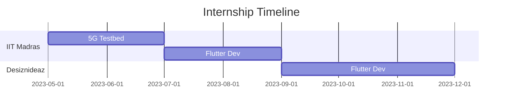

<div align="center">
  
# 👨‍💻 Shreyansh Gupta

[](https://linkedin.com/in/shrey258)
[](https://github.com/shrey258)
[](https://leetcode.com/u/gshrey258)

### Full-Stack Developer | Machine Learning Enthusiast | Problem Solver
</div>

> *"Optimizing a solution is not just about writing code, it's about crafting an experience."*

## 🎯 Quick Overview
```typescript
const shreyansh = {
    education: "B.Tech in Computer Science (CGPA: 8.89) @ SRM Institute of Science and Technology",
    code: ["C++", "Python", "Dart", "JavaScript", "TypeScript", "HTML"],
    tools: ["Flutter", "Node.js", "Express.js", "Riverpod", "RESTful APIs"],
    databases: ["Firebase", "MongoDB", "MySQL"],
    cloud: ["AWS", "GCP", "Azure"],
    currentFocus: "Building scalable applications with cutting-edge technologies"
};
```

## 🏆 Achievements & Milestones
- 🥈 **2nd Place** in Genesis Web3 Hackathon
  - *Recognized for exceptional blockchain-integrated frontend development*
- 📈 **Top 25% on LeetCode**
  - *Highest Contest Rating: 1582*

## 🚀 Featured Projects

### 🌐 Speed Test Application
[](https://github.com/shrey258/speed_test_app)
[](https://github.com/shrey258/speed_test_app)
[](https://github.com/shrey258/speed_test_app)

<div align="center">

[](https://github.com/shrey258/speed_test_app)
[](https://github.com/shrey258/speed_test_app/fork)

</div>

- 🔄 Real-time network speed measurement with intuitive visualization
- 📱 Responsive Flutter frontend with robust Node.js backend architecture
- 🚀 30% faster HTTP data transfer through advanced concurrency optimization
- 🛠️ [View Project](https://github.com/shrey258/speed_test_app)

### 🛸 NASA Project
[](https://github.com/shrey258/nasa_project)
[](https://github.com/shrey258/nasa_project)
[](https://github.com/shrey258/nasa_project)

<div align="center">

[](https://github.com/shrey258/nasa_project)
[](https://github.com/shrey258/nasa_project/fork)

</div>

- 📊 Enterprise-grade CSV parsing system with real-time validation
- 🔒 Bank-level security implementation with SSL/TLS encryption
- ⚡ 25% performance boost through optimized multithreading
- 🛠️ [View Project](https://github.com/shrey258/nasa_project)

### 📱 The Campus Web
[](https://github.com/CampusDataSRM/CampusApp)
[](https://github.com/CampusDataSRM/CampusApp)

<div align="center">

[](https://github.com/CampusDataSRM/CampusApp)
[](https://github.com/CampusDataSRM/CampusApp/fork)

</div>

- 📚 Comprehensive student platform with seamless integration
- 📊 Enhanced performance through Riverpod state management
- 📱 Beautiful, responsive design across all platforms
- 🛠️ [View Project](https://github.com/CampusDataSRM/CampusApp)

## 💼 Professional Experience

### 🎓 IIT Madras Research Park


#### 5G Testbed Project
- 🔬 Developed Python-based speed test programs
- 🌐 Implemented TCP/IP protocols
- 📊 Real-time data analysis

#### Flutter Development
- 📱 Cross-platform speed test application
- ⚡ Optimized for performance
- 🎨 Modern UI/UX implementation

### 💯 Desiznideaz
- 📚 EdTech app frontend development
- 🎨 Modern UI/UX design implementation
- 📱 Cross-platform compatibility

## 🎓 Certifications & Skills

<div align="center">

| Certification | Platform | Status |
|--------------|----------|---------|
| AWS Academy Machine Learning | AWS | ✅ Completed |
| Flutter and Dart | Udemy | ✅ Completed |
| ML: Regression & Classification | Coursera | ✅ Completed |

</div>

## 📫 Get in Touch

<div align="center">

[](mailto:gshrey258@gmail.com)
[](https://github.com/shrey258)

</div>

---
<div align="center">
  
### 📊 GitHub Stats


</div>

---
<div align="center">
  
### 🛠️ Technologies & Tools


</div>
